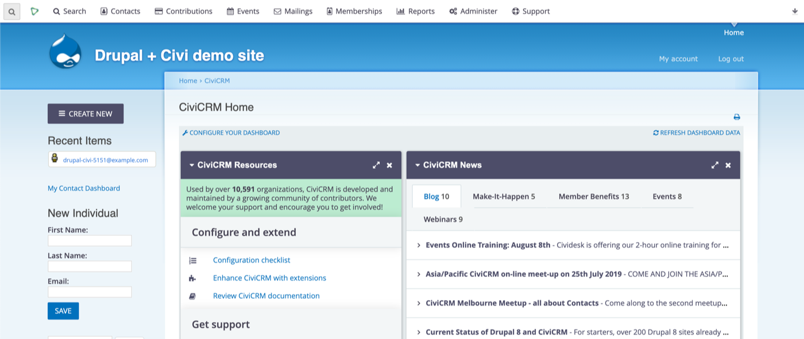
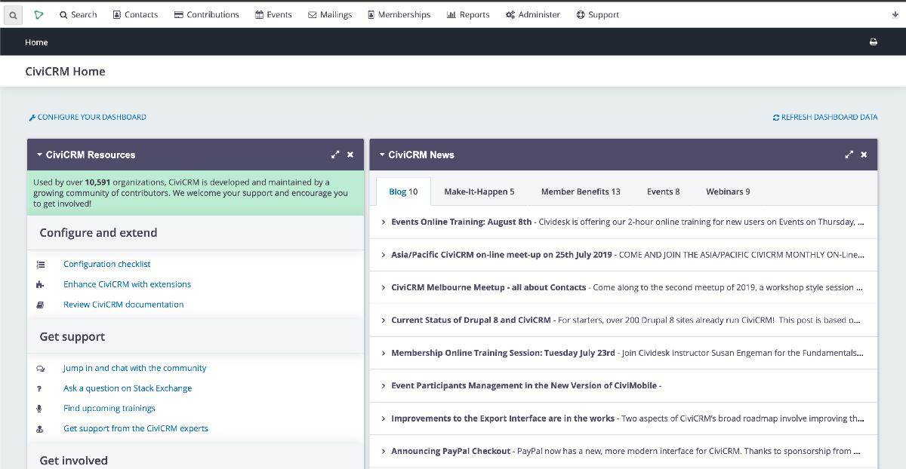

# Shoreditch CiviAdmin Companion Drupal theme

An optional but advisable Drupal 7 CiviCRM Administration theme meant as a companion to the CiviCRM [Shoreditch theme](https://github.com/civicrm/org.civicrm.shoreditch) to be used for CiviCRM administration pages.

The main CiviCRM Shoreditch theme (available separately as a CiviCRM extension) provides styles that adapt the CiviCRM look and feel within the CiviCRM “container” only. This companion theme also styles some further elements of the page (i.e. headers, breadcrumbs) with the purpose of better integrating visually the outer elements of the page with the look and feel of Shoreditch.

**Without**


**With**


Note that this theme and Shoreditch are designed to theme the CiviCRM administration pages only and not any public CiviCRM or website pages.

## Requirements

* The Drupal "Seven" theme must be installed and enabled

## Installation

1. Run the following commands

    ```bash
    # Enable the "CiviCRM Theme" module
    drush en -y civicrmtheme

    # Create the theme folder
    cd <site-root>/sites/all/themes/
    mkdir shoreditch_companion_d7_theme
    cd shoreditch_companion_d7_theme

    # Download ad enable the theme, then set is as the CiviCRM admin theme
    git clone https://github.com/compucorp/shoreditch-companion-d7-theme.git
    drush en -y shoreditch_companion_d7_theme
    drush vset civicrmtheme_theme_admin shoreditch_companion_d7_theme

    # Clear the civi cache
    drush cc civicrm
    ```

2. Go to _/admin/structure/block/list/shoreditch_companion_d7_theme_
3. Keep the "Main page content" block in the "Content" region, disable any other block
